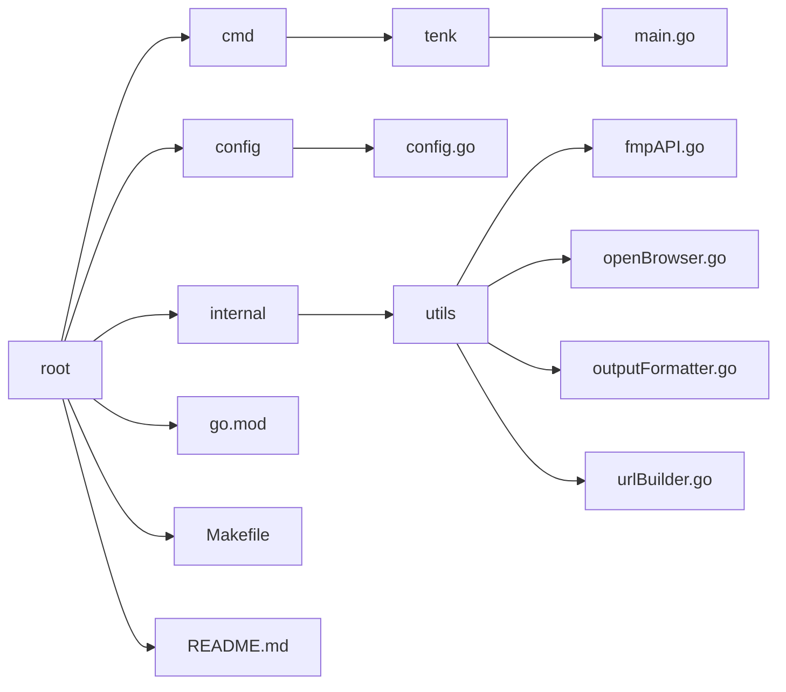

# TENK


## Overview
This tool was designed to increase the efficiency of retrieving a company's 10-k annual report. TENK offers a simple CLI alternative to the SEC's EDGAR tool. TENK will retrieve any annual reports, if filed, for years dating back to 1996. You can search over 70,000 symbols.

## Installation

Before using TENK, make sure you have the following dependencies installed on your system:
- Go (version 1.21.8 or higher)
- An API key from [Financial Modeling Prep](https://site.financialmodelingprep.com/)
- `make` <br>

1. **Clone the Repository**: <br>
   Clone the repository to your local machine using the following command:
   ```shell
   git clone https://github.com/mmclinton/tenk.git
   ```

2. **Navigate to the Repository**: <br>
   Change into the directory where you downloaded the repository:
   ```shell
   cd tenk
   ```

3. **Set Up Your Api Key**: <br>
   You need to obtain an API key from [Financial Modeling Prep](https://site.financialmodelingprep.com/) to use this tool. Once you have obtained your API key, insert it into the following command and run it:
   ```shell
   make api_key="<YOUR API KEY HERE>"
   ```
   This command creates a configuration file (config.json) in the directory ~/.config/tenk with your API key. If something goes wrong during the setup process or if your API key changes later, you can edit the API key directly in the config.json file located in ~/.config/tenk.

## Usage
Using TENK is simple. You'll invoke tenk with a series of flags from within your shell. You can see the flags and their descriptions below. You must utilize the `-ticker` flag, seeing as a query cannot be made without this information.

**Usage of TENK**:<br>
  `-ticker` *[required]*<br>
      Designate the desired US stock ticker symbol.<br><br>
  `-year` *[optional]*<br>
      Designate the desired year for the annual report. If no year is given, all available annual reports are returned. <br><br>
  `-open` *[optional]*<br>
      Designate to automatically open the report in the default browser. By default the requested report is returned to the shell. <br><br> 

Try TENK with this example:
```shell
tenk -ticker aapl -year 2023
```

## Project Directory Structure
Here's the directory structure of the project:



## License
This project is licensed under the [MIT License](LICENSE). 