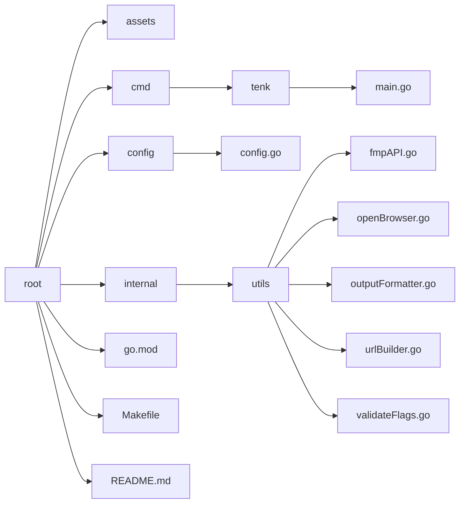

# TENK


## Overview
This tool was designed to increase the efficiency of retrieving a company's 10-K annual report. TENK offers a simple CLI alternative to the SEC's EDGAR tool, allowing users to retrieve annual reports, if filed, for years dating back to 1996. You can search over 70,000 symbols.

## Installation

Before using TENK, make sure you have the following dependencies installed on your system:
- **Go** (version 1.21.8 or higher)
- **API key** from [Financial Modeling Prep](https://site.financialmodelingprep.com/)
- `make` <br>

### Option 1: Download the Latest Release <br>

1. **Download the Source Code:**<br>
Go to the [latest release](https://github.com/mmclinton/tenk/releases/tag/v1.1.0) page and download the source code archive (available as `.zip` or `.tar.gz`). Extract the archive to your local machine.

2. **Navigate to the Project Directory:**<br>
```shell
cd tenk
```

3. **Set Up Your API Key:**<br>
Obtain an API key from [Financial Modeling Prep](https://site.financialmodelingprep.com/), then insert it into the following command and execute:
```shell
make api_key="<YOUR API KEY HERE>"
```
This command creates a configuration file (`config.json`) in `~/.config/tenk` with your API key. If you need to update the key later, you can edit `config.json` directly in `~/.config/tenk`.

### Option 2: Clone the Current Repository<br>

1. **Clone the Repository:**<br>
```shell
git clone https://github.com/mmclinton/tenk.git
cd tenk
```

2. **Follow the Setup:** Run the `make` command with your API key as shown above in step 3.

## Usage
Using TENK is simple. You'll invoke TENK with a series of flags from within your shell. You must use the -ticker flag, as a query cannot be made without this information.

**Usage of TENK**:<br>
  `-ticker` *required*: 
      Designate the desired US stock ticker symbol.<br><br>
  `-year` *optional*:
      Designate the desired year for the annual report. If no year is given, all available annual reports are returned. <br><br>
  `-open` *optional*
      Automatically open the report in the default browser. By default, the requested report is returned to the shell. <br><br> 
  `-before` *optional*:
      Return all annual reports before the specified year, including the year provided. This can be combined with `-after` to set a range. <br><br>
  `-after` *optional*:
      Return all annual reports after the specified year, including the year provided. This can be combined with `-after` to set a range.<br><br>

Try TENK with this example:
```shell
tenk -ticker aapl -after 2015
```

## Project Directory Structure
Here's the directory structure of the project:



## License
This project is licensed under the [GLWTS License](LICENSE). 
